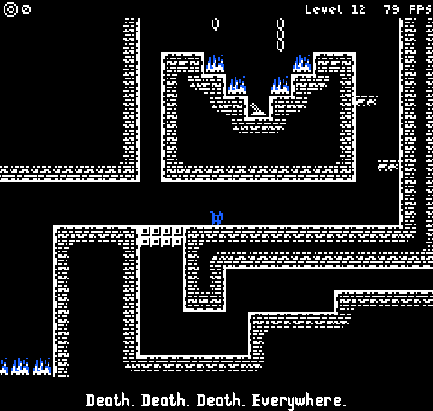

# Donjon
Donjon is a short platformer game made from scratch using JavaFX.  
Move around with Blue, double jump and grab the soul from each level.  
The narrator can be a bit boring...

#### Controls
Keyboards control can be changed in game in the Settings menu.  
The default ones:
- Jump - `Space`
- Left - `Q`
- Right - `D`
- Interact - `E`

#### Special thanks
[Monkopus](https://monkopus.itch.io/harmonic) for the Harmonic font  
[Marsh Arcade](https://masharcade.itch.io/bitty) for the Bitty font  
[Arks](https://arks.itch.io/) for the game assets that I changed a little bit  
[phoenix1291](https://opengameart.org/content/sound-effects-pack-2) for the sounds effect  
[Nicole Marie T](https://opengameart.org/content/spy-16bit-8bit-chiptune-retro-style-song-for-your-games) for the music theme

